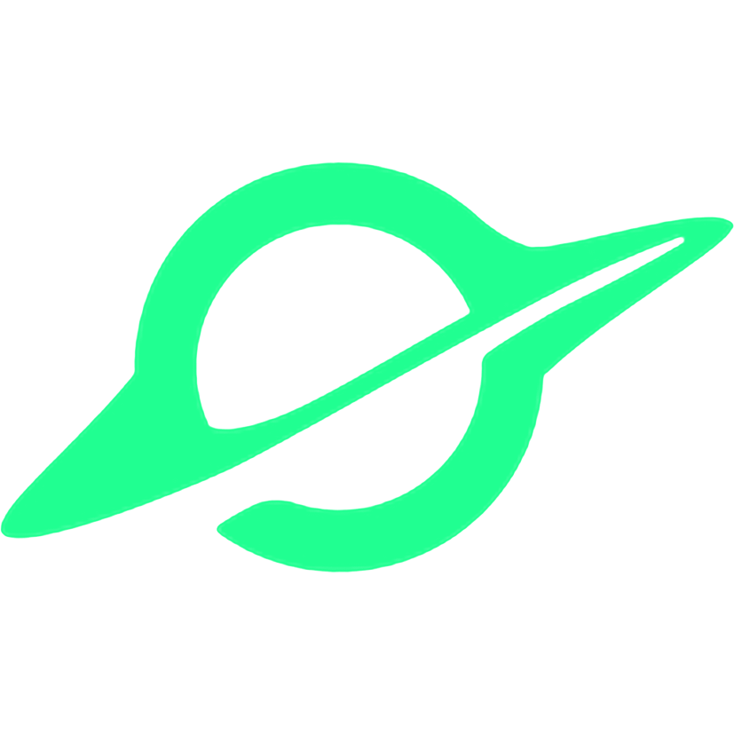
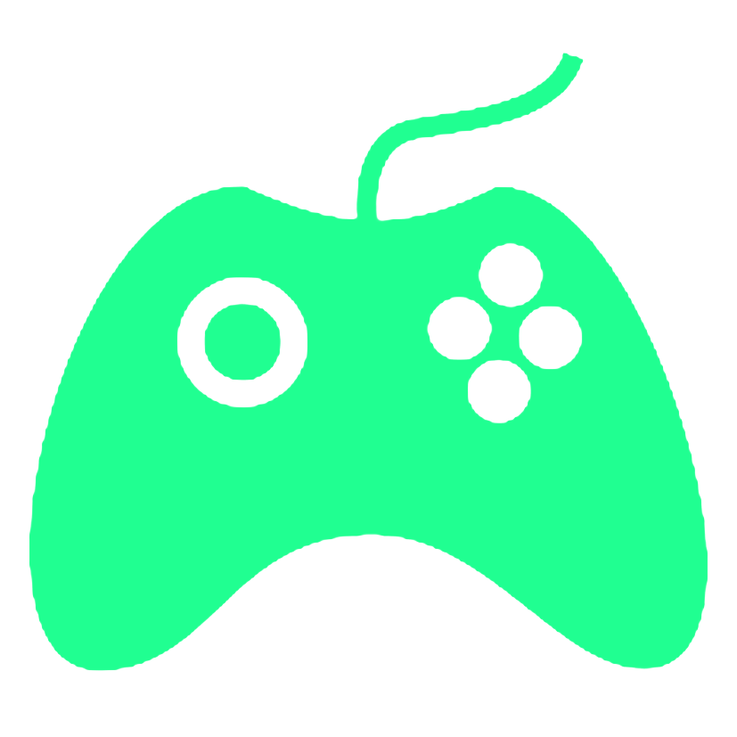
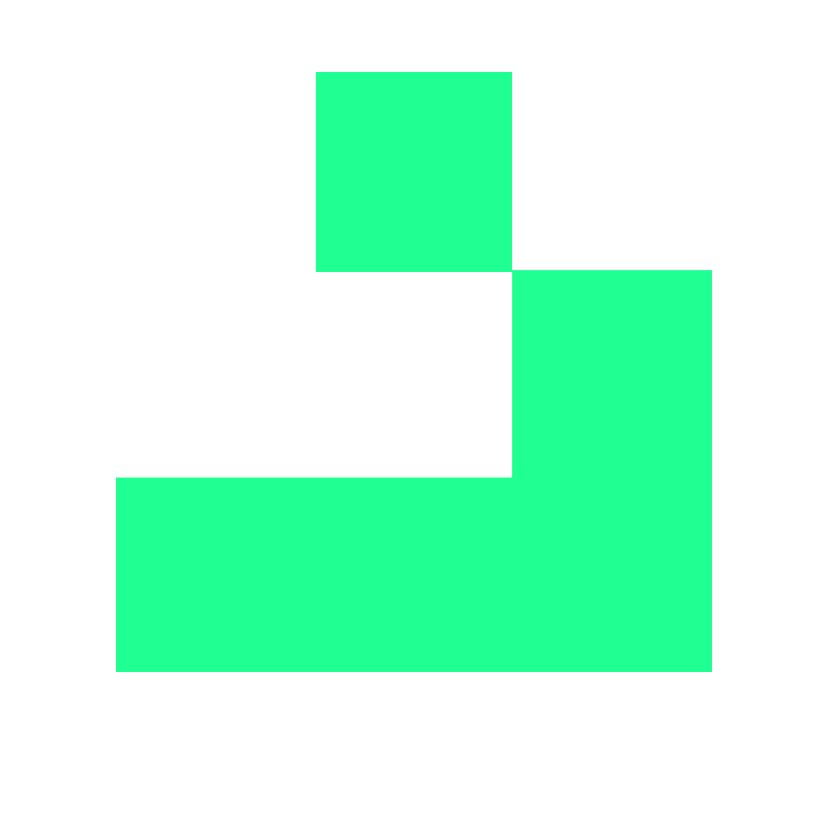

<!-- banner section -->


  

<!-- Brief section -->

<h2 align="center">
  Full Stack Developer |  <a href=https://www.instagram.com/quentinsshit/>Digital artist</a> sometimes</p>
  
  <!--  -->
  <!-- include Initializing & Pending ?-->
  
</h2>

<!-- Social icons section -->
<p align="center">
  <a href="https://www.linkedin.com/in/quentin-callay">
    
  </a>
  &#8287;&#8287;&#8287;&#8287;&#8287;
  <a href="https://open.spotify.com/user/awyeahhhh?si=90601f2c60054fcf">
    
  </a>
  &#8287;&#8287;&#8287;&#8287;&#8287;
  <a href="https://www.instagram.com/quentinsshit">
    
  </a>
  &#8287;&#8287;&#8287;&#8287;&#8287;
  <a href="https://steamcommunity.com/id/QuipTM/">
    
  </a>
  &#8287;&#8287;&#8287;&#8287;&#8287;
</p>

<!-- Description section -->
<table align="center">
  <tr>
    <td>
      <p> Deep into Astrophysics</p>
      <p> Artificial Intelligence is my go-to computer subject</p>
      <p> Passionate about competitive video games</p>
      <p> Continuously inspired by Mathematics, specifically Cellular Automatas</p>
      <p> Always in search of learning</p>
    </td>
  </tr>
</table>

<p align="center">
  
</p>

<br>

<!-- Languages & Tools section-->
<h2> Languages & Tools </h2>

<!-- Languages -->


<!-- Frameworks -->


<!-- Databases -->

<!-- Design -->


<!-- Code section -->

<!-- ```python
class Quentin:

    def __init__(self):
        self.interests = ["Programming", "Artifical Intelligence", "Astrophysics",
                          "PC building", "Digital Art", "Video Games"]
        self.languages = ["Python", "C", "C++", "Javascript", "HTML", "CSS", "TypeScript", "Mongo"]
        self.projects = {
            "EEG_flappybird (contribution)" : "Python",
            "Fight Match (school project)" : "Python",
            "Memory Manager (school project)" : "C++"
        }
    
    def say_about(self):
        print(f"I love {', '.join(self.interests)}")
        print(f"I dabble in {', '.join(self.languages)}")
        print("Projects:", end=" ")
        for project, language in self.projects.items():
            print(f"{project} in {language},", end=" ")

quentin = Quentin()
quentin.say_about()
```
-->

<!--  >  
-->

